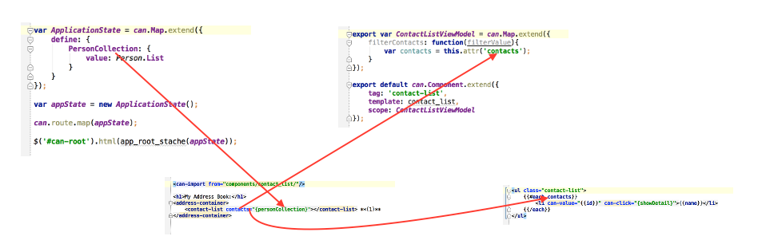

#Observables and Scope Chains in CanJS
It is often the most powerful parts of a framework that create confusion for new developers. These elements, when comprehended, frequently become the favorite tools of the developers using the framework. Angular's directives are a well-known example of this. In CanJS, two things that can seem a bit mistifying to the new developer are Observables and Shared Scopes.

##Observables
If you're already familiar with the Observer pattern, you can skip ahead to [Implementing](#Implementing).

CanJS applications are component based. A correctly built CanJS app will be composed of several can.Components, carefully integrated to form a whole. When we use a component-based method of appliction composition, each component should address a specific, encapsulated abstraction within the problem domain.  This ensures that there is a clear boundary between components (a separation of responsiblities), which makes them easier to test, reuse, and maintain.

While it is important for components to remain separate and encapsulated, for them to work together to create an application, they must be able to communicate with each other. This is where the Observer pattern comes in. In the Observer pattern, two actors, the Observer and the Subject, forge a relationship. The Observer watches the Subject. When a change occurs in the subject, the observer is notified of this change and can respond accordingly.

To help clarify this concept, let's look at an example. Imagine we have a site that sells widgets. Our application uses a can.Model.List named "Widgets" to provide a list of all the widgets currently available for sale. Each widget returned by the can.Model.List contains an id, a description, a price, and an isSold property. In order to display this information to the user, the application uses a  can.Component called WidgetDashboard. The WidgetDashboard shows all of the widgets, and provides a means of selecting Widgets to purchase.

The "Widgets" can.Model.List (and the individual Widget objects it contains) is the Subject. WidgetDashboard is the Observer. If a widget is updated (e.g., purchased, edited, or removed), because the WidgetDashbaord is observing the widgets, its state changes are displayed to the user as they occur.

###Implementing an Observer 
While we talk about the observer watching the subject, this isn't actually how the pattern works when you implement it. The observer actully registers with the subject. Then, when a state change occurs, the subject notifies the observer of the change.

To create an observer-subject relationship in CanJS, all you have to do is include a reference to an observable element in the Subject. Let's look at an example, using our ficitious Widget application.

My Widgets model will be defined as follows:

    import can from "can"

    export default can.Model.extend({
            resource: "/services/widgets"
        },
     {});

>As a side note, in the code above, we're using the `resource` property of can.Model. the `resource` property is a very useful shorthand for defining default methods on a can.Model. The code above is equivalent to the longer can.Model definition:

    export default can.Model.extend({
        findAll: "GET /widgets",
        findOne: "GET /widgets/{id}",
        create: "POST /widgets",
        update: "PUT /widgets/{id}",
        destroy: "DELETE /widgets/{id}"
    },{});

>You can use the `resource` property short hand if the objects returned by your service have an id of "id".

The ViewModel for my WidgetDashboard will be defined as follows:

    import can from "can";
    import WidgetModel from "models/widgets";
    import "can/map/define/";
    ... //Other imports

    export var WidgetDashboardViewModel = can.Map.extend({
        define: {
      		widgets: {
            	Value: WidgetModel.List
            }
            widgetsAvailable: {
                get: function () {
                    //Create the Observer-Subject relationship between
                    //WidgetDashboardViewModel, and WidgetModel
                    var widgets = this.attr('widgets');
                    if (widgets) {
                        return widgets.length;
                    }

                }
            }
        },

We create the Observer-Subject relationship between WidgetDashboardViewModel (Observer) and WidgetModel (Subject) when we make reference to the length property of widgets in the widgetsAvailable property's get function. In fact, it is more accurate to say that we've created an Observer-Subject relationship between the widgetsAvailable property's get function (Observer), and the WidgetModel(Subject).  The get function is watching for changes in (i.e., observing) the widget's can.Model.List collection's length.

What this means, practically, is that the WidgetDashboardViewModel's widgetsAvailable get function will run if the length property of the WidgetModel.List changes (i.e., an item is added to or removed from WidgetModel.List).

##Understanding The Scope Chain in CanJS
CanJS makes use of a hierarchical scope chain to pass information between objects in an application. Understanding how the scope chain works is essential to understanding how to build CanJS applications.

###Scope
Like many other JS frameworks, CanJS makes use of an observable scope object (a can.Map, to be specific) to share values between a can.Component, and it's view template. There are several ways to define a scope for a can.Component, including:

- Direct,
- ViewModel, and
- Inherited

Both the Direct and ViewModel methods are component-specific scopes. They belong to the component, as a distinct, encapsulated entity. Both require that you include a `scope` property on the can.Component.

####Direct
To directly define the scope of your can.Component, you provide the implementation of the scope as an anonymous object literal, as follows:

	can.Component.extend({
    	tag: 'my-tag',
   		template: myStacheTemplate,
  		scope: {
        	sampleProperty: 'Sample Property'
        }
    });

While this is possible, and may make sense in certain instances, it is not the generally preferred method.

####ViewModel
Using a ViewModel is the preferred method of implementing a component-specific scope. Because a can.Component's scope is a can.Map, a view model must be a can.Map.

The advantage of separating the ViewModel from the can.Component is that you can independently test your ViewModel.

You can create a ViewModel, and assign it to a can.Component's scope, as follows:

    var SampleViewModel = can.Map.extend({
        define: {
            mySampleProperty: {
                value: 'Sample Property'
            }
        }
    });

	can.Component.extend({
    	tag: 'my-tag',
   		template: myStacheTemplate,
  		scope: SampleViewModel
    });

Calling can.Map.extend creates a constructor function for a can.Map. However, in most cases, you will not create an instance of the ViewModel and assign it to the scope. When you assign the constructor function to the scope, CanJS will instantiate the ViewModel automatically. If you were to provide an instance of the ViewModel to the scope, that instance would be shared amongst all instances of the can.Component. By providing a constructor function, rather than an instance, each time the can.Component is created, it will receive its own instance of the ViewModel you defined.

####Inherited
can.Components can automatically inherit values on their scope from either the Application State, or the scope of a parent can.Component. This is one of the areas of CanJS that can get tricky, because a can.Component can have several objects or properties available to its scope that are not defined anywhere on the can.Component itself. Furthermore, when values are passed to a can.Component it is done using the view template. There is no indication anywhere in code that there is a connection between a can.Component and its parent scope. 

Let's look at an example of this:

    **(1)**
    var ApplicationState = can.Map.extend({
        define: {
            PersonCollection: {
                value: Person.List
            }
        }
    });

    var appState = new ApplicationState();

    **(2)**
    can.route.map(appState);

    **(3)**
    $('#can-root').html(app_root_stache(appState));

In the code above, we **(1)** define the application state object for our application, and create an instance of it. **(2)**, assign the instance of our application state to become our route's can.Map; and **(3)**, bind the appState instance to our root view template.

In our application, we have a can.Component, ContactList, that displays the names and telephone numbers of all the people in our application's PersonCollection. To do this, ContactList needs to read data from the PersonCollection defined on the appState object. To give contacts access to appState's PersonCollection, we establish a link between the scopes of appState and ContactList. When we create this link, we will establish a scope hierarchy---one scope will be the parent, and one the child. Because we are passing a value from appState to ContactList, appState is the parent scope, and ContactList's scope is the child scope. 

Creating the scope link is done, not in code, but in the view template of the parent scope, as below:

    <can-import from="components/contact_list/"/>

    <h1>My Address Book:</h1>
    <address-container>
        <contact-list contacts="{personCollection}"></contact-list> **(1)**
    </address-container>

Note in **(1)**, we have included a `contacts` attribute in the component tag, with a value of `{personCollection}`. This attribute creates the scope link. It makes the parent scope's personCollection available to the child scope. The name of the attribute will be the name used in the child scope to refer to the parent scope's object.

In the example above, you would use the variable name `contacts` inside of ContactList to refer to the personCollection. Note that the variable name `contacts` need never appear anywhere in ContactList's scope definition. Let's look at that now:

    export var ContactListViewModel = can.Map.extend({
        showDetail: function(){ ... }
    });

    export default can.Component.extend({
        tag: 'contact-list',
        template: contact_list,
        scope: ContactListViewModel
    });

As is clear, there no reference anywhere in the code above to a variable named `contacts`. Yet, when we examine ContactList's contact_list view template, we could see the following:

    <ul class="contact-list">
    {{#each contacts}}
        <li can-value="{{id}}" can-click="{showDetail}">{{name}}</li>
    {{/each}}
    </ul>

Additionally, we might see references to variables in the View Model that have not been defined directly anywhere in the View Model, such as:

    export var ContactListViewModel = can.Map.extend({
        filterContacts: function(filterValue){
			var contacts = this.attr('contacts');
      	}
     	...
    });

##Review
The Observer pattern describes a relationship between objects, where one object, the observer, observes and responds to changes in another object, the subject. Observables are central to constructing a CanJS application, and understanding how CanJS works. While this article used the example of working with Observables to create communication channels between can.Models and can.Components, Observables are also important in:

- Routing,
- Data binding, and
- Data management

Creating an Observer-Subject relationship in CanJS is as easy as making a reference to the property of an Observable Subject in a method of the Observer.

Scope chains are created by passing a value (or values) from either an ApplicationState object instance or a can.Component's scope (the parent scope) to another can.Component's scope (the child scope) using the view template that connects them. This is accomplished by including an attribute on the can.Component's HTML tag that defines both the child scope's variable name (attribute name), and its value (attribute value).

Values passed from the parent scope appear automatically on the child scope---i.e., there is no explicit reference to them on the scope object.

